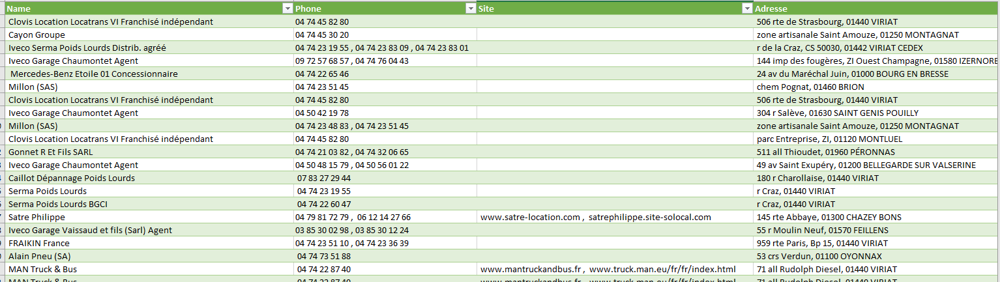
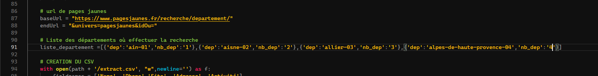

# Scrapper-pages-jaunes
Petit programme permettant de scrapper le site des  pages jaunes afin de récupérer différents champs. Le programme récupère toutes les pages de la recherche et peut être-lancé sur plusieurs départements.  

## Sources
Je suis parti de ce tuto que j'ai amélioré et réadapté: https://lobstr.io/index.php/2018/11/21/comment-scraper-les-coordonnees-sur-pagesjaunes-fr-avec-python-3-et-requests/

## Lancement
Pour lancer il suffit de se mettre dans une console et de faire:  
```python .\scrapperPajesJaunes.py "poids lourds" ./ ```  
Le premier paramètre correspond au mot-clé recherché et le deuxième au chemin ou le csv sera enregistré.


## Sortie
Exemple de sortie après avoir ouvert le csv avec excel


## Ajout de département
il suffit de rajouter des départements en gardant la même syntaxe que ci-dessous dans le fichier scrapperPajesJaunes.py  
    ```python
        liste_departement =[{'dep':'ain-01','nb_dep':'1'},{'dep':'aisne-02','nb_dep':'2'}]
    ```
### Exemple 
Imaginons que vous souhaiter ajouter le département alpes de haute provence dans la liste de départements, pour l'instant la liste ressemble à ça :
    ```python
        liste_departement =[{'dep':'ain-01','nb_dep':'1'},{'dep':'aisne-02','nb_dep':'2'}]
    ```
Maintenant allons sur le site de pages jaunes et faisont une recherche avec le département alpes de haute provence, ce qui correspond au numéro de département 4,  
  
Ensuite nous allons copier le nom de département qui est affiché dans l'url et vérifié le numéro de département (cette partie n'est pas vraiment nécessaire, sans surprise le numéro de département de l'url est bien le 4)

Pour finir on copie tout ça dans notre fichier scrapperPajesJaunes.py  
      
Et Voilà! Sauvegardé votre fichier et c'est bon 
